# Bankmarketing AutoML + Pipelines Experiment

This project intends to make with little to no effort a Classification model with the Automated ML and put it into production with the aid of Azure Machine Learning. All of the files can be found at the `starter_files/` directory.

## Architectural Diagram

**Automated ML**
Below it is represented through a flowchart the overall process of Machine Learning Operations tasks that were possible to be achieved with this project 

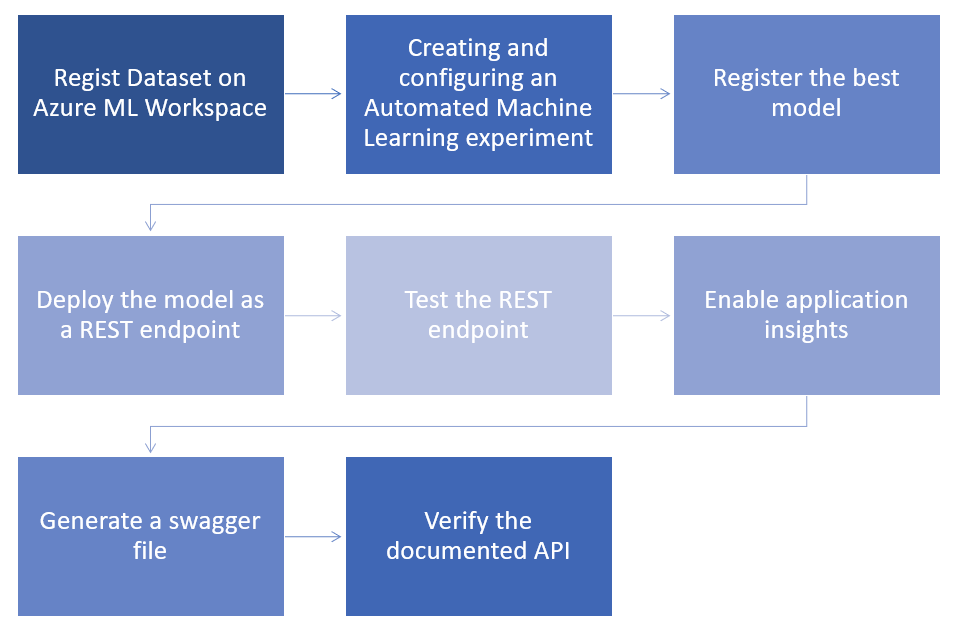

Firstly, the Dataset was registered within the Azure ML workspace, then the Automated ML run was configured, setting up the compute cluster that would be responsible for running the jobs - and some specifications, such as the maximum number of concurrent runs and so on. When the job was finished, the best model had an Accuracy of over `90%` and was hence chosen to be registered. Once the model was registered onto the Azure ML model registry, it was extremely simple to deploy it into a REST endpoint with a Key-based authentication. I have tested the endpoint with a POST request with the aid of the Python requests library. After enabling the App Insights (which can be done either via UI or by using the SDK), a Swagger JSON file was generated, which made it possible to use along with Swagger UI Docker image, to see further how to document an API, with the required data, expected outputs and so on.

**Model Pipeline**
Another approach was made using the Azure Machine Learning Pipeline SDK, where I have defined two main steps, by getting the Data, and running the Automated ML with the output being the generated metrics. Once that was done, it was possible to make the Pipeline available as a REST endpoint, where it can be then re-ran using any other service and guarantee reproducibility and replicability of the model created, which is another very important aspect of MLOps.

## Key Steps

Here I will give a more detail description of the steps to conclude this project.

**Automated ML**

Below we can see a picture of the registered dataset
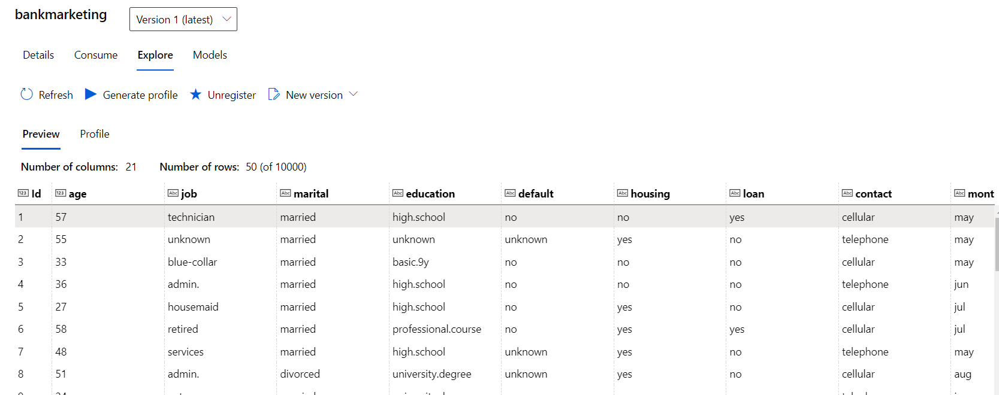

And then, after setting up the Automated ML, we can see the completed experiment below along with the best model from this run:

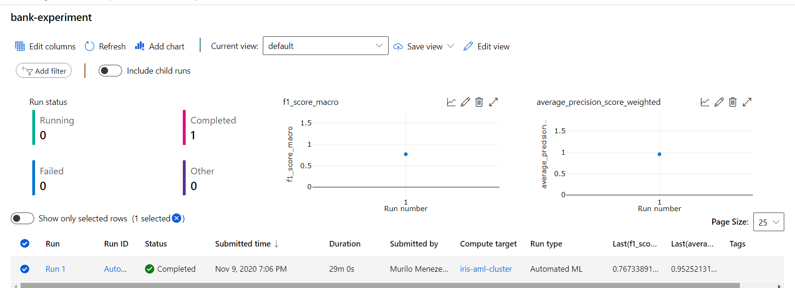
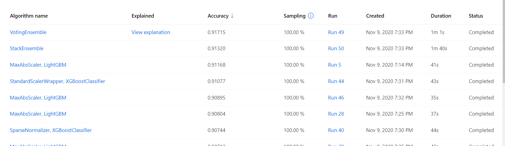

After that, the model was deployed, and I have enabled App insights and checked the logs from the deployed service.
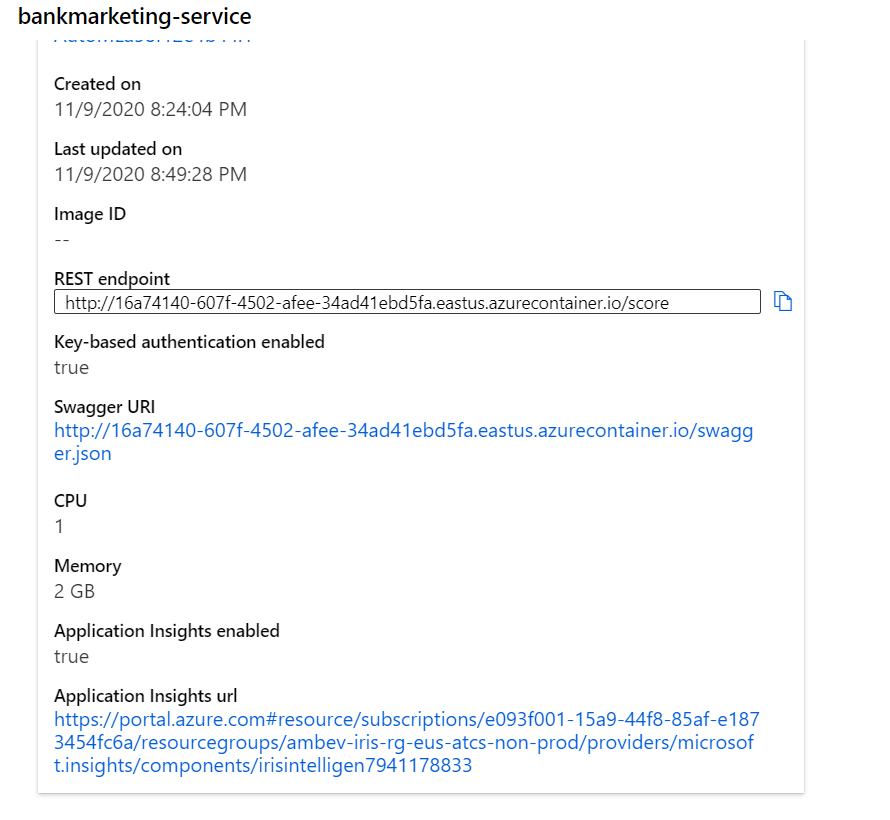
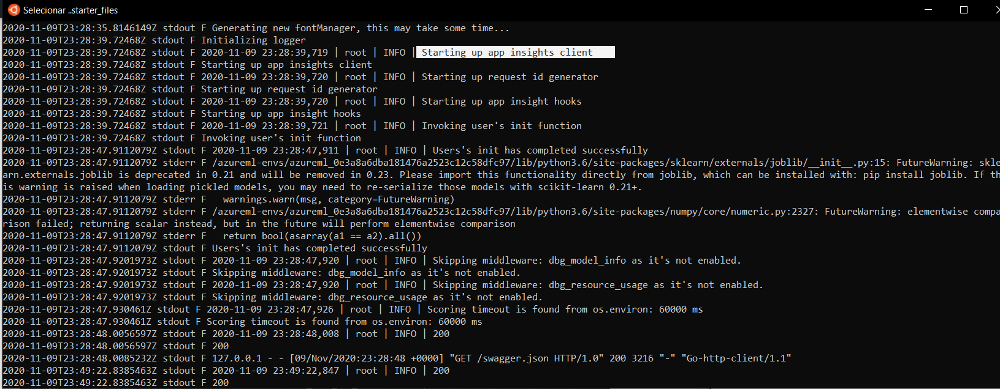

And then tested the model with the `endpoints.py` module making a POST request to the available endpoint, along with its Key-authentication

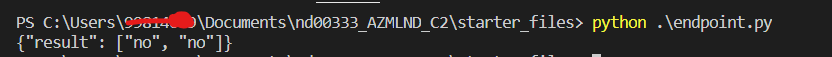

We can also check in the following screenshot, the API documentation with Swagger
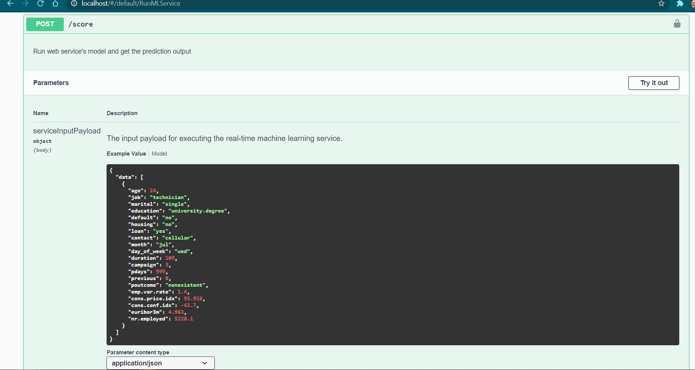

**Model Pipeline**

The very first step for this approach is the pipeline creation. I have also taken a screenshot of the Run Widget of the pipeline, which are shown below

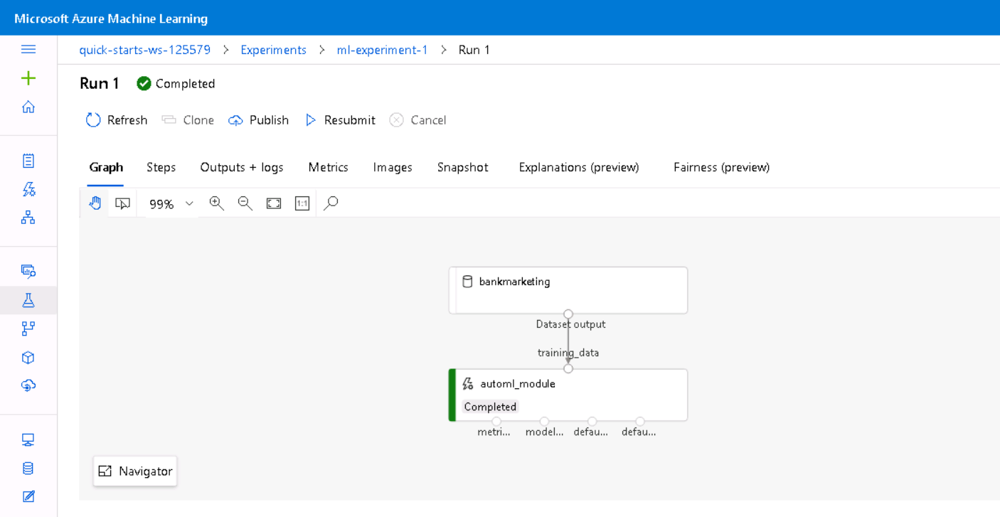

And then the available pipeline endpoint is also presented as the following picture shows

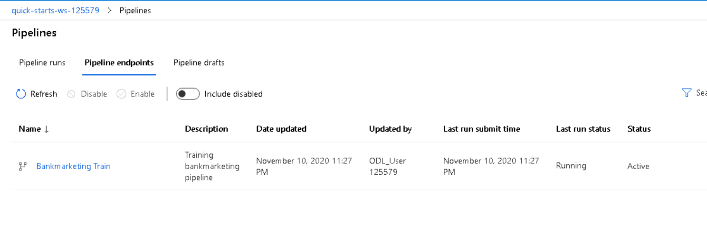

We can see the published pipeline overview, with its status as "Active" and the available endpoint with the following picture

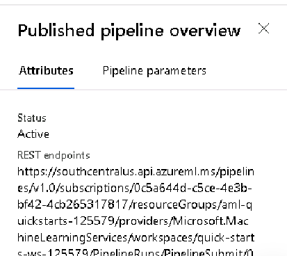

And finally, the widget of the ran pipeline via the REST endpoint can be seen in the next screenshot

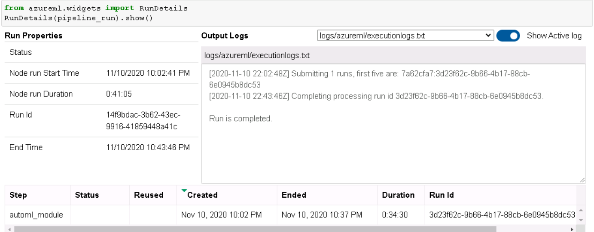

## Screen Recording

